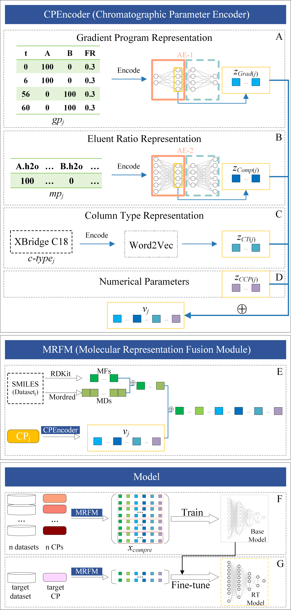

[TOC]


# [Prediction of retention time by combining multiple datasets with chromatographic parameter vectorization and transfer learning]()




## Main Directory Structure
```bash
MDL-TL/
├──CPEncoder                        # Chromatographic parameter encoder
│    ├── Column Type Encoder        # Chromatographic column type encoder
│    ├── Eluent Ratio Encoder       # Chromatographic eluent ratio encoder
│    ├── Gradient Program Encoder   # Chromatographic gradient program encoder
├── data         
│    ├── gen                        # model input                   
│    ├── origin                     # original data
│    ├── pred_data                  # candidates for prediction
│    ├── processed                  # processed data
│    ├── smiles_rt                  # smiles and RT data for pre-training and finetuning
│    ├── target                     # split index and standardized molecular representation 
├── data_process                    # generate molecular representation from the 'data/smiles_rt' data
├── train_base_model                # pre-training
├── train_small_data                # fine-tuning and predict
├── utils                           # custom toolkit
```

## Environment setup
We provide an environment.yml file and a requirements.txt for quick environment configuration.
You can create a conda environment by environment.yml (**recommended**):
```bash
conda env create -f environment.yml

conda activate MDL_TL
```
or by requirements.txt:
```bash
conda create -n MDL_TL python=3.7.10
conda activate MDL_TL
pip install -r requirements.txt
```

## Usage

### Data preprocess
1. Place your SMILES and RT file in the data/smiles_rt directory and navigate to the ```data_process``` directory. Then get molecular representations:
```bash
python file_ops.py
```
2. Place your Chromatographic Parameter file in the data/origin directory and navigate to the ```CPEncoder``` directory. Then get CP encodings:
```bash
python Column Type Encoder/ColumnTypeEncoder.py
python Eluent Ratio Encoder/AEmain.py
python Gradient Program Encoder/AEmain.py
```
3. Navigate to the project root directory and retrieve the dataset splits and corresponding model input files:
```bash
python main.py
```
> Tips: We have uploaded the relevant data from 14 RPLC datasets as examples.

### Pre-train
**If you want to train a base model using your own data, please follow the steps below:**

Navigate to the ```train_base_model``` directory and pre-train:
```bash
python main.py
```

### Transfer
**If you want to fine-tune a base model generated by "Pre-train" step, please follow the steps below:**
Navigate to the ```train_small_data``` directory and transfer:
```bash
python transfer.py
```
Collect the results after transfer is completed:
```bash
python pred_collect.py
```